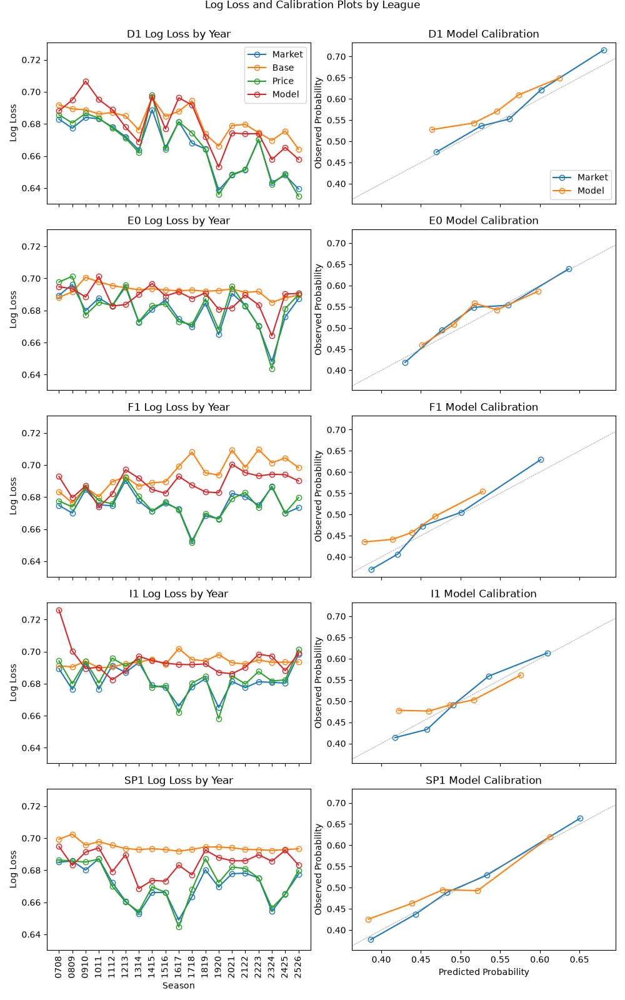

# Over/Under 2.5 Goals Logistic Regression Model
This is a simple logistic regression notebook to demonstrate understanding of the model building process and the relevant libraries (pandas, scikit-learn, numpy). 

## Results and Findings
### Pooled Results
Pooled Results
|       |   Log Loss |   Brier |
|:------|-----------:|--------:|
| base  |     0.6916 |  0.2492 |
| price |     0.6763 |  0.2418 |
| mkt   |     0.675  |  0.2411 |
| model |     0.6872 |  0.2471 | 

- **Price beats model** The log loss for the model (0.6872), while better than the baseline's (0.6916), is still higher than even the implied probability from pricing (0.6763), with the overround still attached. This shows the model's forecasting power isn't just weaker than the market's, it's weaker than the market's inflated estimate. Against the devigged probabilities, the gap is even larger (market implied probability = 0.6750).

### Skill Scores
|       |   Log Loss |      Brier |
|:------|-----------:|-----------:|
| base  | 0          | 0          |
| price | 0.0221     | 0.03       |
| mkt   | 0.024      | 0.0325     |
| model | 0.0063     | 0.0087     |
- **Difficult to differentiate from the baseline** The highest skill score any forecaster achieves above the baseline is the market's Brier score at 3.25%. This is because the baseline uncertainty is near-maximum. Resolution, the main driver in both the market's and the model's skill scores, is tiny, as it is difficult to sort any games as comfortably identifiable as over or under from outcomes that can be altered by so many random events.

### Brier Decomposition
Brier Decomposition by League
|                   |    n |   Uncertainty |   Reliability |   Resolution |   Brier |
|:------------------|-----:|--------------:|--------------:|-------------:|--------:|
| ('D1', 'Market')  | 5725 |        0.2436 |        0.0004 |       0.0068 |  0.2372 |
| ('D1', 'Model')   | 5725 |        0.2436 |        0.0015 |       0.002  |  0.2431 |
| ('E0', 'Market')  | 7115 |        0.249  |        0.0003 |       0.0053 |  0.2441 |
| ('E0', 'Model')   | 7115 |        0.249  |        0.0004 |       0.0019 |  0.2476 |
| ('F1', 'Market')  | 6800 |        0.2495 |        0.0003 |       0.0081 |  0.2417 |
| ('F1', 'Model')   | 6800 |        0.2495 |        0.0012 |       0.0019 |  0.2487 |
| ('I1', 'Market')  | 7098 |        0.25   |        0.0002 |       0.0057 |  0.2446 |
| ('I1', 'Model')   | 7098 |        0.25   |        0.0008 |       0.001  |  0.2498 |

Pooled Brier Decomposition
| forecaster   |     n |   Uncertainty |   Reliability |   Resolution |   Brier |
|:-------------|------:|--------------:|--------------:|-------------:|--------:|
| Market       | 33868 |        0.2486 |        0.0003 |       0.007  |  0.2418 |
| Model        | 33868 |        0.2486 |        0.0009 |       0.0022 |  0.2473 |
- **Sharpness vs. Calibration** 
The market beats the model in both reliability and resolution, but the main driver in the difference is the resolution gap, which is roughly 8 times larger than the reliability gap. The market gains most of its edge in confidently straying from the baseline, but also in getting it right, whereas the model's predictions stay closer to the baseline rate, but also stray slightly further from the observed values.
## Data
The data is sourced from football-data.co.uk, where basic match statistics are uploaded weekly.

## Methodology
The methodology flows as follows:
1. Data Downloading and Parsing/Cleaning
Goals, shots and odds data from Europe's top 5 leagues (E0:English Premier League, SP1: Spanish La Liga, D1: German Bundesliga, I1: Italian Serie A, F1: French Ligue 1) is downloaded using the requests library from football-data.co.uk. For each league, data from the 05/06 to 25/26 seasons are stored in a dictionary, leagueDict, with the league code as key.
2. Feature Engineering
4 form features are built for each side for each game using only prior games: average shots for and against per game and average goals for and against per game from the past 5 games. These features are 4 of the most obvious predictors for the number of goals in a match that are also easily accessible from this dataset. Form carries across season boundaries, despite the fact a team may look completely different between seasons, as previous seasons' form is still considered to be a good enough predictor that it is better than omitting the data, and in the case of a team being relegated and promoted later, their form is still expected to be that of a team fighting for relegation. 
3. Model Building
A series of logistic regression models are then built using a simple pipeline, where inputs are first standardised before being pushed through the scikit-learn logistic regression function. Each season from 2007/2008 is tested on a model which was trained on all seasons prior. 
4. Model Testing/Plots
The model outputs for each season are then assessed compared to 3 other probabilities: the baseline approach, which just uses a single predicted probability of the observed frequency in the training set, price implied probability, which is the implied probability from the price, and the market implied probability, which uses the normalised (devigged) probability from the price (this is done by simply dividing the implied price probability by the implied price probability sum over the 2 markets, which is obviously a crude method but for our purposes, where all events are closer to a coin toss than a certainty and no observation strays to an extreme, it is considered an effective method).

## Results

 

